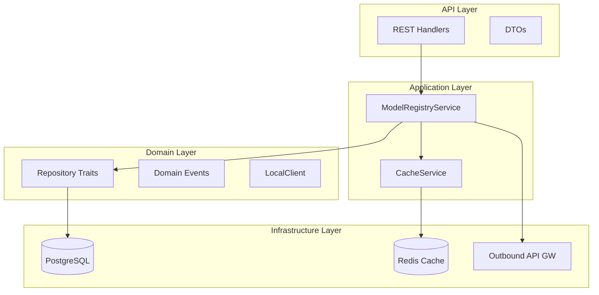
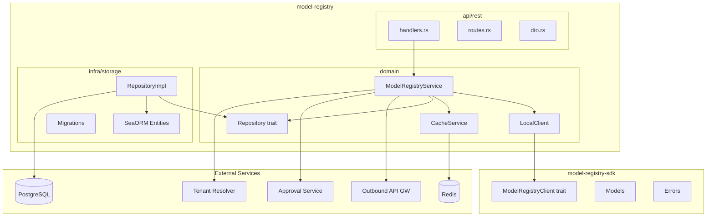
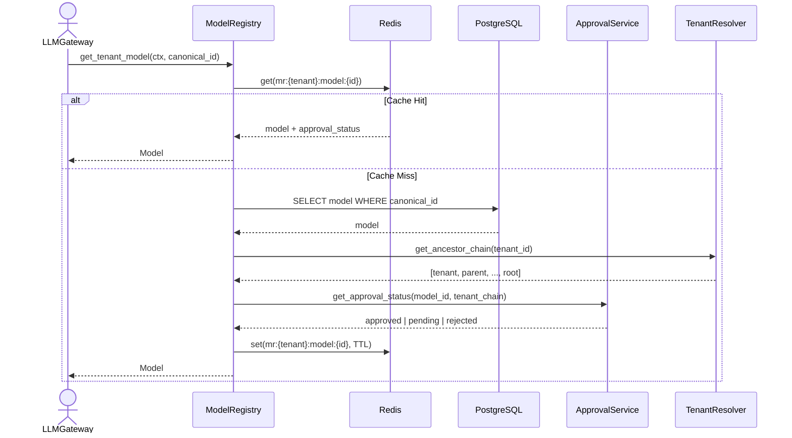
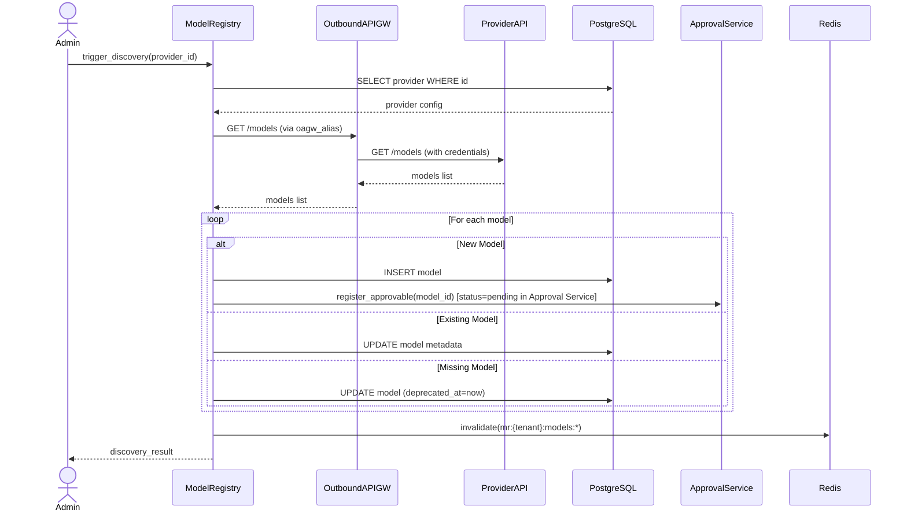
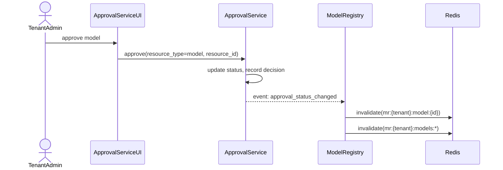

<!-- Updated: 2026-04-17 by Constructor Tech -->

# Technical Design — Model Registry

## 1. Architecture Overview

### 1.1 Architectural Vision

Model Registry provides a centralized catalog of AI models with tenant-level availability and approval workflows. The service is the authoritative source for model metadata, capabilities, API resolution (provider routing and OAGW alias), default inference parameters, context window limits, cost data, and tenant access control. LLM Gateway queries the registry to resolve model identifiers to provider endpoints and verify tenant access.

The architecture follows the CyberFabric SDK pattern with clear separation between public API surface (`model-registry-sdk`) and implementation (`model-registry`). The system is optimized for high read throughput (1000:1 read:write ratio) with distributed caching (Redis default, pluggable backend). All provider API calls route through Outbound API Gateway for credential injection and circuit breaking.

The design emphasizes tenant isolation with hierarchical inheritance. Providers and approvals inherit down the tenant tree additively, with child tenants able to shadow inherited providers. Cache isolation ensures tenant data separation with TTL-based invalidation.

### 1.2 Architecture Drivers

#### Functional Drivers

- [ ] `p1` — `cpt-cf-model-registry-fr-tenant-isolation` — Tenant ID prefix in cache keys, query filters enforce tenant scope
- [ ] `p1` — `cpt-cf-model-registry-fr-authorization` — Role-based + GTS-based access control via SecurityContext
- [ ] `p1` — `cpt-cf-model-registry-fr-input-validation` — DTO validation in REST layer, domain validation in service
- [ ] `p1` — `cpt-cf-model-registry-fr-cache-isolation` — Cache key format `mr:{tenant_id}:{entity}:{id}`, TTL strategy
- [ ] `p1` — `cpt-cf-model-registry-fr-get-tenant-model` — Cache-first lookup with DB fallback, approval status check
- [ ] `p1` — `cpt-cf-model-registry-fr-list-tenant-models` — OData pagination with capability/provider filtering
- [ ] `p1` — `cpt-cf-model-registry-fr-model-discovery` — OAGW integration, provider plugin abstraction
- [ ] `p1` — `cpt-cf-model-registry-fr-model-approval` — Approval Service integration, event-driven status sync
- [ ] `p1` — `cpt-cf-model-registry-fr-provider-management` — CRUD with inheritance/shadowing support
- [ ] `p1` — `cpt-cf-model-registry-fr-model-pricing` — AICredits cost data per tier (sync/batch/cached)
- [ ] `p1` — `cpt-cf-model-registry-fr-manual-trigger` — Discovery API endpoint, rate-limited
- [ ] `p2` — `cpt-cf-model-registry-fr-auto-approval` — Approval Service criteria schema, rule evaluation delegation
- [ ] `p2` — `cpt-cf-model-registry-fr-health-monitoring` — Health status derived from discovery calls, stored per provider
- [ ] `p2` — `cpt-cf-model-registry-fr-alias-management` — Alias table with tenant hierarchy resolution
- [ ] `p2` — `cpt-cf-model-registry-fr-degraded-mode` — Tiered behavior: metadata from cache, approval check fails
- [ ] `p2` — `cpt-cf-model-registry-fr-tenant-reparenting` — Cache invalidation on `tenant.reparented` event
- [ ] `p2` — `cpt-cf-model-registry-fr-bulk-operations` — Batch approval via Approval Service
- [ ] `p3` — `cpt-cf-model-registry-fr-user-group-approval` — Group-scoped approval restriction layer
- [ ] `p3` — `cpt-cf-model-registry-fr-user-level-override` — User-level override takes precedence over group/tenant

#### NFR Allocation

| NFR ID | NFR Summary | Allocated To | Design Response | Verification Approach |
|--------|-------------|--------------|-----------------|----------------------|
| `cpt-cf-model-registry-nfr-performance` | get_tenant_model <10ms P99 | Cache Layer + Repository | Distributed cache (Redis) with 30min TTL for own data, 5min for inherited | Performance benchmarks measure P99 latency |
| `cpt-cf-model-registry-nfr-availability` | 99.9% uptime | Service + Cache | Stateless design, cache fallback to DB, fail-closed for approval checks | Availability monitoring, SLO dashboards |
| `cpt-cf-model-registry-nfr-scale` | 10K tenants, 2M models | Repository + Cache | Cache isolation by tenant, indexed queries, connection pooling | Load testing at scale targets |
| `cpt-cf-model-registry-nfr-rate-limiting` | Admin ops rate limited | API Layer | Rate limit middleware, configurable per-operation limits | Rate limit metrics, 429 response monitoring |

### 1.3 Architecture Layers



| Layer | Responsibility | Technology |
|-------|---------------|------------|
| API | Request/response handling, validation, OData parsing | REST/OpenAPI, Axum handlers |
| Application | Business logic orchestration, cache management | Domain service, cache service |
| Domain | Repository traits, domain events, SDK client impl | Rust traits, async-trait |
| Infrastructure | Data persistence, caching, external calls | PostgreSQL, Redis, OAGW |

## 2. Principles & Constraints

### 2.1 Design Principles

#### Tenant Isolation

**ID**: `cpt-cf-model-registry-principle-tenant-isolation`

All operations are scoped by tenant context. Cache keys include tenant ID prefix. Query filters enforce tenant hierarchy visibility. Write operations validate tenant ownership. Admin operations verify actor role for target tenant.

#### Cache-First Reads

**ID**: `cpt-cf-model-registry-principle-cache-first`

**ADR**: `cpt-cf-model-registry-adr-pluggable-cache`

Read operations check distributed cache before database. Cache misses populate cache from DB. TTL-based expiry prevents stale data accumulation. Own data uses 30-minute TTL; inherited data uses 5-minute TTL for faster propagation of parent changes. Cache backend is pluggable (Redis default, InMemory for testing, custom plugins supported).

#### Additive Inheritance

**ID**: `cpt-cf-model-registry-principle-additive-inheritance`

**ADR**: `cpt-cf-model-registry-adr-tenant-inheritance`

Providers and approvals inherit down the tenant hierarchy additively. Child tenants see parent's providers plus their own. Child tenants can shadow inherited providers by creating a provider with the same slug. Child tenants cannot expand beyond parent's permissions.

#### Approval Service Delegation

**ID**: `cpt-cf-model-registry-principle-approval-delegation`

**ADR**: `cpt-cf-model-registry-adr-approval-delegation`

Model Registry does not implement approval workflow logic. It delegates to a generic Approval Service that handles state machine, concurrency control, and audit trail. Model Registry registers models as approvable resources and reacts to approval status change events.

### 2.2 Constraints

#### Outbound API Gateway Dependency

**ID**: `cpt-cf-model-registry-constraint-oagw-dependency`

**ADR**: `cpt-cf-model-registry-adr-oagw-provider-access`

All provider API calls for model discovery must route through Outbound API Gateway. OAGW handles credential injection, circuit breaking, and outbound URL policy enforcement. Direct provider calls are not permitted.

#### No Credential Storage

**ID**: `cpt-cf-model-registry-constraint-no-credentials`

Model Registry does not store provider credentials. Provider configuration includes slug, name, GTS type, OAGW alias, and discovery settings. All provider access routes through OAGW upstreams referenced by `oagw_alias`. Credential management is OAGW responsibility.

#### Approval Service Integration

**ID**: `cpt-cf-model-registry-constraint-approval-service`

Approval workflow (state machine, notifications, audit) is handled by generic Approval Service. Model Registry provides model-specific criteria schema for auto-approval rules. This constraint ensures consistent approval patterns across the platform.

#### Immutable Provider Slugs

**ID**: `cpt-cf-model-registry-constraint-immutable-slugs`

Provider slugs are immutable after creation. Changing a slug would invalidate all canonical model IDs referencing that provider. Slug format: 1-64 chars, lowercase alphanumeric + hyphen, unique within tenant.

#### Content Logging Restrictions

**ID**: `cpt-cf-model-registry-constraint-content-logging`

Provider cost data and model capabilities are not PII, but discovery responses may contain sensitive provider information. Logging includes only metadata (tenant, provider slug, model count, latency).

## 3. Technical Architecture

### 3.1 Domain Model

**Technology**: Rust structs (SDK models)

**Location**: [`model-registry-sdk/src/models.rs`](../model-registry-sdk/src/models.rs)

**Core Entities**:

| Entity | Description | Priority |
|--------|-------------|----------|
| Provider | Configured AI provider instance for a tenant | P1 |
| Model | AI model in the catalog with capabilities and cost | P1 |
| ModelApproval | Tenant approval status for a model (via Approval Service) | P1 |
| AutoApprovalRule | Rules for automatic model approval | P2 |
| ProviderHealth | Provider discovery health status | P2 |
| Alias | Human-friendly name mapping to canonical ID | P2 |

**Relationships**:
- Model → Provider: Many-to-one (model belongs to provider via provider_id)
- Provider → Tenant: Many-to-one (provider owned by tenant)
- ModelApproval → Model: Many-to-one (approval for specific model in tenant context)
- Alias → Model: Many-to-one (alias points to canonical model ID)

**Key Domain Types**:

```
CanonicalModelId = "{provider_slug}::{provider_model_id}"
ProviderSlug = 1-64 chars, lowercase alphanumeric + hyphen
LifecycleStatus = production | preview | experimental | deprecated | sunset
ApprovalStatus = pending | approved | rejected | revoked
ProviderHealthStatus = healthy | degraded | unhealthy
SupportedApi = completion | embedding
ReasoningEffort = none | low | medium | high | xhigh
ServiceTier = auto | default | flex | priority
```

**`ModelInfo`** — all model data lives inside `ModelInfo` on the `Model` struct:

- **display_name** (`String`) — display name shown in UI
- **description** (`Option<String>`) — model description
- **family** (`Option<String>`) — model family (e.g. `"gpt-4"`, `"claude"`, `"llama"`)
- **vendor** (`Option<String>`) — model vendor (e.g. `"OpenAI"`, `"Anthropic"`, `"Meta"`)
- **region** (`Option<String>`) — deployment region (e.g. `"us-east-1"`, `"eu-west-1"`)
- **hosted_by** (`Option<String>`) — infrastructure host (e.g. `"Azure"`, `"AWS Bedrock"`, `"self-hosted"`)
- **last_release_at** (`Option<DateTime>`) — when the model version was last released by the vendor
- **reasoning_level** (`Option<String>`) — informational reasoning level label, display-only
- **version** (`Option<String>`) — model version string
- **sort_order** (`Option<i32>`) — display order in model picker / lists
- **icon** (`Option<String>`) — URL to model icon
- **multiplier_display** (`Option<String>`) — human-readable cost multiplier label (e.g. `"1x"`, `"3x"`)
- **performance** (`ModelPerformance`) — estimated performance characteristics
  - **response_latency_ms** (`Option<u32>`) — expected response latency in milliseconds
  - **tokens_per_second** (`Option<u32>`) — expected generation speed
- **additional_info** (`HashMap<String, Value>`) — arbitrary key-value metadata for provider- or deployment-specific info
- **api_resolution** (`ApiResolution`) — routing and resolution for calling the model via OAGW
  - **supported_api** (`Vec<SupportedApi>`) — which API types this model supports (completion, embedding)
  - **api_family** (`String`) — provider plugin family (e.g. `"openai"`, `"anthropic"`, `"ollama"`)
  - **oagw_alias** (`String`) — OAGW upstream alias for credentials and base URL routing
  - **provider_model_id** (`String`) — provider's model identifier, used in `canonical_id` and sent to provider; users can create aliases for alternative names
- **capabilities** (`ModelCapabilities`) — what the model can do
  - **vision** (`bool`) — supports image/vision input
  - **reasoning** (`ReasoningCapability`) — reasoning controls
    - **effort** (`bool`) — supports `reasoning_effort` parameter
    - **toggle** (`bool`) — supports toggling reasoning on/off
    - **resume** (`bool`) — supports resuming a reasoning chain
    - **budget** (`bool`) — supports explicit reasoning token budget
  - **function_calling** (`bool`) — supports function/tool calling
  - **response_schema** (`bool`) — supports structured output via JSON schema
  - **streaming** (`bool`) — supports streaming responses
  - **file_input** (`bool`) — supports file input (PDFs, documents)
  - **image_generation** (`bool`) — can generate images
  - **code_interpreter** (`bool`) — supports sandboxed code execution
  - **web_search** (`WebSearchCapability`) — web search capability
    - **enabled** (`bool`) — web search is available
    - **allowed_domains** (`bool`) — supports configuring allowed domains
- **disabled_capabilities** (`ModelCapabilities`) — same structure as `capabilities`; flags set to `true` indicate the capability is administratively disabled
- **context_window** (`ContextWindow`) — token limits
  - **max_input_tokens** (`u32`) — maximum input tokens
  - **max_output_tokens** (`Option<u32>`) — maximum output tokens; `None` for embedding models
  - **output_vector_size** (`Option<u32>`) — output vector dimensionality for embedding models
- **parameters** (`ModelParameters`) — default inference parameters and override policy
  - **temperature** (`Option<f64>`) — sampling temperature
  - **reasoning_effort** (`Option<ReasoningEffort>`) — default reasoning effort (`None`, `Low`, `Medium`, `High`, `XHigh`)
  - **max_tokens** (`Option<u32>`) — default per-request output token cap (distinct from `context_window.max_output_tokens` hard limit)
  - **top_p** (`Option<f64>`) — nucleus sampling parameter
  - **stop** (`Option<Vec<String>>`) — stop sequences
  - **service_tier** (`Option<ServiceTier>`) — request routing tier (`Auto`, `Default`, `Flex`, `Priority`)
  - **extra_body** (`Option<Value>`) — provider-specific extra parameters
  - **allow_parameter_override** (`bool`) — whether users can override set parameters per-request
  - **allow_extra_params** (`Vec<String>`) — which extra parameter names users may pass in the request body
- **cost** (`ModelCost`) — token pricing in micro-credits per 1K tokens (`u64`, scaled x1,000,000)
  - **input_token_cost_micro** (`Option<u64>`) — micro-credits per 1K input tokens
  - **output_token_cost_micro** (`Option<u64>`) — micro-credits per 1K output tokens
  - **cached_input_token_cost_micro** (`Option<u64>`) — micro-credits per 1K cached input tokens

### 3.2 Component Model



#### model-registry-sdk

**ID**: `cpt-cf-model-registry-component-sdk`

SDK crate containing public API surface. Transport-agnostic trait, models, and errors. Consumers depend only on this crate.

**Interface**: `ModelRegistryClient` trait with async methods taking `&SecurityContext`.

#### ModelRegistryService

**ID**: `cpt-cf-model-registry-component-service`

Domain service orchestrating business logic. Handles cache management, repository access, OAGW calls for discovery, and Approval Service integration.

**Interface**: Internal domain methods, event emission.

#### LocalClient

**ID**: `cpt-cf-model-registry-component-local-client`

Local client implementing `ModelRegistryClient` trait. Bridges domain service to SDK interface. Registered in ClientHub for in-process consumers.

**Interface**: Implements `ModelRegistryClient` trait.

#### CacheService

**ID**: `cpt-cf-model-registry-component-cache`

Distributed cache abstraction. Handles cache key generation with tenant prefix, TTL management, and invalidation. Backends are compiled-in via Cargo feature flags (not runtime plugins): `RedisCache` (default for production), `InMemoryCache` (for testing and lightweight single-node deployments). Deployments without Redis are supported — the in-memory backend avoids the operational overhead of a separate Redis instance while the database's own query cache provides comparable latency for moderate-scale setups. Redis becomes beneficial at high scale (10K+ tenants, 2M+ models) where cross-instance cache consistency and horizontal scaling matter.

**Interface**: `get`, `set`, `delete`, `invalidate_tenant`.

#### RepositoryImpl

**ID**: `cpt-cf-model-registry-component-repository`

SeaORM-based repository implementation. Handles CRUD operations, tenant-scoped queries, and OData filtering.

**Interface**: Implements `ModelRegistryRepository` trait.

### 3.3 API Contracts

**Technology**: REST/OpenAPI

**Location**: Auto-generated via `utoipa` from handler annotations

**Endpoints Overview**:

| Method | Path | Description | Priority |
|--------|------|-------------|----------|
| `GET` | `/model-registry/v1/models` | List tenant models with OData filtering | P1 |
| `GET` | `/model-registry/v1/models/{canonical_id}` | Get model by canonical ID | P1 |
| `GET` | `/model-registry/v1/providers` | List tenant providers | P1 |
| `POST` | `/model-registry/v1/providers` | Register new provider | P1 |
| `PATCH` | `/model-registry/v1/providers/{id}` | Update provider (status, discovery config) | P1 |
| `POST` | `/model-registry/v1/providers/{id}/discover` | Trigger model discovery | P1 |
| `GET` | `/model-registry/v1/providers/{id}/health` | Get provider discovery health | P2 |
| `GET` | `/model-registry/v1/aliases` | List tenant aliases | P2 |
| `POST` | `/model-registry/v1/aliases` | Create alias | P2 |
| `DELETE` | `/model-registry/v1/aliases/{name}` | Delete alias | P2 |

**OData Support**:
- `$filter`: `lifecycle_status`, `approval_status`, `info.api_resolution.api_family`, `info.api_resolution.supported_api`, `info.capabilities.vision`, `info.capabilities.function_calling`, `info.capabilities.streaming`, `info.capabilities.reasoning.effort`, `info.vendor`, `info.family`
- `$select`: field projection
- `$top`, `$skip`: pagination
- `$orderby`: sorting

### 3.4 Internal Dependencies

| Dependency Module | Interface Used | Purpose |
|-------------------|----------------|---------|
| `tenant-resolver` | SDK client via ClientHub | Resolve tenant hierarchy (parent chain) |
| `approval-service` | SDK client via ClientHub | Manage approval workflow, query status |
| `outbound-api-gateway` | SDK client via ClientHub | Execute provider API calls for discovery |

**Dependency Rules**:
- No circular dependencies
- Always use SDK modules for inter-module communication
- `SecurityContext` must be propagated across all in-process calls

### 3.5 External Dependencies

#### Redis (Distributed Cache)

**ID**: `cpt-cf-model-registry-interface-redis`

**Type**: Database
**Direction**: bidirectional
**Protocol / Driver**: Redis protocol via `redis-rs` or `bb8-redis`
**Data Format**: JSON-serialized cache entries
**Compatibility**: Redis 6.x+, supports cluster mode

**Cache Key Format**: `mr:{tenant_id}:{entity}:{id}`

**TTL Strategy**:
- Own data (tenant created): 30 minutes
- Inherited data (from parent): 5 minutes

#### PostgreSQL

**ID**: `cpt-cf-model-registry-interface-postgresql`

**Type**: Database
**Direction**: bidirectional
**Protocol / Driver**: SeaORM with PostgreSQL driver
**Data Format**: Relational schema (see 3.7)
**Compatibility**: PostgreSQL 14+

#### Provider APIs (via OAGW)

**ID**: `cpt-cf-model-registry-interface-provider-apis`

**Type**: External API
**Direction**: outbound
**Protocol / Driver**: HTTP/REST via Outbound API Gateway
**Data Format**: Provider-specific JSON (handled by provider plugins)
**Compatibility**: Provider plugin responsibility

### 3.6 Interactions & Sequences

#### Get Tenant Model

**ID**: `cpt-cf-model-registry-seq-get-tenant-model`

**Use cases**: `cpt-cf-model-registry-usecase-get-tenant-model`

**Actors**: `cpt-cf-model-registry-actor-llm-gateway`



**Description**: Resolves a canonical model ID for a tenant, checking cache first, then database with approval status from Approval Service. Returns model info with provider details if approved.

#### Model Discovery

**ID**: `cpt-cf-model-registry-seq-model-discovery`

**Use cases**: `cpt-cf-model-registry-usecase-model-discovery`

**Actors**: `cpt-cf-model-registry-actor-platform-admin`



**Description**: Fetches models from provider API via OAGW, updates catalog (new models as pending, existing models updated, missing models deprecated), and invalidates cache for the owner tenant. Child tenants that inherit these models are **not** explicitly invalidated — they rely on the shorter TTL for inherited data (5 minutes vs 30 minutes for own data) to pick up changes. Explicitly invalidating all descendant caches would require traversing the tenant tree on every discovery run.

#### Model Approval Integration

**ID**: `cpt-cf-model-registry-seq-model-approval`

**Use cases**: `cpt-cf-model-registry-usecase-model-approval`

**Actors**: `cpt-cf-model-registry-actor-tenant-admin`



**Description**: Approval workflow managed by Approval Service. Model Registry receives status change events and invalidates relevant cache entries.

### 3.7 Database Schema

#### Table: providers

**ID**: `cpt-cf-model-registry-dbtable-providers`

| Column | Type | Constraints | Description |
|--------|------|-------------|-------------|
| id | UUID | PK | Primary key |
| tenant_id | UUID | NOT NULL, INDEX | Owner tenant |
| slug | VARCHAR(64) | NOT NULL | Human-readable identifier |
| name | VARCHAR(255) | NOT NULL | Display name |
| gts_type | VARCHAR(255) | NOT NULL | GTS type identifier |
| oagw_alias | VARCHAR(255) | NOT NULL | OAGW upstream alias for provider API access |
| status | VARCHAR(20) | NOT NULL, DEFAULT 'active' | active, disabled |
| managed | BOOLEAN | NOT NULL, DEFAULT false | Whether CyberFabric can manage this provider (e.g. install/unload models on ollama, lm_studio) |
| metadata | JSONB | | Provider-specific metadata, GTS-typed (e.g. `gts.cf.genai.models.provider.v1~x.genai.local.provider.v1~` for local providers with capabilities like `install_model`, `import_model`, `streaming`) |
| discovery_enabled | BOOLEAN | NOT NULL, DEFAULT false | Discovery feature flag |
| discovery_interval_seconds | INTEGER | | Discovery interval |
| created_at | TIMESTAMPTZ | NOT NULL | Creation timestamp |
| updated_at | TIMESTAMPTZ | NOT NULL | Last update timestamp |

**Indexes**: (tenant_id), (tenant_id, slug) UNIQUE

**Constraints**: slug immutable after creation (enforced at application level)

#### Table: models

**ID**: `cpt-cf-model-registry-dbtable-models`

| Column | Type | Constraints | Description |
|--------|------|-------------|-------------|
| id | UUID | PK | Primary key |
| provider_id | UUID | FK, NOT NULL | Foreign key to providers |
| tenant_id | UUID | NOT NULL, INDEX | Owner tenant (denormalized for query performance) |
| canonical_id | VARCHAR(512) | NOT NULL | Format: `{provider_slug}::{provider_model_id}` |
| lifecycle_status | VARCHAR(20) | NOT NULL | production, preview, experimental, deprecated, sunset |
| architecture | VARCHAR(64) | | Model architecture (qwen, llama, etc.) |
| size_bytes | BIGINT | | Model size for capacity planning |
| format | VARCHAR(32) | | Model format (gguf, mlx, safetensors, api-only) |
| capabilities | JSONB | NOT NULL | GTS-typed capability flags (base type `gts.cf.genai.model.capabilities.v1~`), e.g. text_input, image_input, streaming |
| limits | JSONB | | GTS-typed model limits (base type `gts.cf.genai.model.limits.v1~`), e.g. context_window, max_output_tokens |
| provider_cost | JSONB | | GTS-typed AICredits per tier (base type `gts.cf.genai.model.provider_cost.v1~`), sync/batch/cached |
| version | VARCHAR(64) | | Provider's model version |
| deprecated_at | TIMESTAMPTZ | | Soft-delete timestamp |
| created_at | TIMESTAMPTZ | NOT NULL | Creation timestamp |
| updated_at | TIMESTAMPTZ | NOT NULL | Last update timestamp |
| api_resolution | JSONB | NOT NULL | `ApiResolution`: supported API types (completion/embedding), api family (provider plugin), OAGW alias, provider model ID (used in `canonical_id` and sent to provider; users can create aliases to expose a different name) |
| capabilities | JSONB | NOT NULL | `ModelCapabilities`: vision, reasoning (effort/toggle/resume/budget), function calling, response schema, streaming, file input, image generation, code interpreter, web search (enabled + allowed_domains support flag) |
| disabled_capabilities | JSONB | NOT NULL | `ModelCapabilities`: same structure as `capabilities`; flags set to `true` indicate the capability is administratively disabled |
| context_window | JSONB | NOT NULL | `ContextWindow`: max input tokens, max output tokens (optional for embedding models), output vector size |
| parameters | JSONB | NOT NULL | `ModelParameters`: temperature, reasoning effort (`ReasoningEffort` enum), max tokens, top_p, stop (optional), service tier (`ServiceTier` enum), extra body; override policy (allow parameter override, allow extra params) |
| info | JSONB | NOT NULL | `ModelInfo`: display name, description, family, vendor, region, hosted by, last release at, reasoning level, version, UI hints (sort order, icon, multiplier display), performance (latency, tokens/sec), additional info dict |
| cost | JSONB | NOT NULL | `ModelCost`: input/output/cached input token cost in micro-credits per 1K tokens (`u64`, scaled ×1,000,000) |

**Indexes**: (tenant_id), (tenant_id, canonical_id) UNIQUE, (provider_id), (lifecycle_status)

**JSONB GIN Indexes** (for OData filtering on nested fields):
- `api_resolution` GIN on `api_family`
- `capabilities` GIN for capability flag queries
- `info` GIN on `vendor`, `family`

#### Table: provider_health (P2)

**ID**: `cpt-cf-model-registry-dbtable-provider-health`

| Column | Type | Constraints | Description |
|--------|------|-------------|-------------|
| provider_id | UUID | PK, FK | Foreign key to providers |
| tenant_id | UUID | NOT NULL | Owner tenant |
| status | VARCHAR(20) | NOT NULL | healthy, degraded, unhealthy |
| latency_p50_ms | INTEGER | | Discovery latency P50 |
| latency_p99_ms | INTEGER | | Discovery latency P99 |
| consecutive_failures | INTEGER | NOT NULL, DEFAULT 0 | Failure count |
| consecutive_successes | INTEGER | NOT NULL, DEFAULT 0 | Success count |
| last_check_at | TIMESTAMPTZ | | Last health check |
| last_success_at | TIMESTAMPTZ | | Last successful check |
| last_error | VARCHAR(64) | | Error code |
| last_error_message | TEXT | | Error details (admin only) |
| updated_at | TIMESTAMPTZ | NOT NULL | Last update timestamp |

**Indexes**: (tenant_id)

#### Table: aliases (P2)

**ID**: `cpt-cf-model-registry-dbtable-aliases`

| Column | Type | Constraints | Description |
|--------|------|-------------|-------------|
| id | UUID | PK | Primary key |
| tenant_id | UUID | NOT NULL, INDEX | Owner tenant |
| name | VARCHAR(64) | NOT NULL | Alias name |
| canonical_id | VARCHAR(512) | NOT NULL | Target canonical model ID |
| created_at | TIMESTAMPTZ | NOT NULL | Creation timestamp |
| created_by | UUID | NOT NULL | Actor who created |

**Indexes**: (tenant_id, name) UNIQUE

**Constraints**: canonical_id must be a canonical ID, not another alias (enforced at application level)

## 4. Additional Context

### Error Handling

Error codes follow RFC 9457 Problem Details standard. Domain errors map to SDK errors, which map to Problem responses:

| Domain Error | SDK Error | HTTP Status | Problem Type |
|--------------|-----------|-------------|--------------|
| ModelNotFound | ModelNotFound | 404 | model_not_found |
| ModelNotApproved | ModelNotApproved | 403 | model_not_approved |
| ModelDeprecated | ModelDeprecated | 410 | model_deprecated |
| ProviderNotFound | ProviderNotFound | 404 | provider_not_found |
| ProviderDisabled | ProviderDisabled | 404 | provider_disabled |
| InvalidTransition | InvalidTransition | 409 | invalid_transition |
| ValidationError | ValidationError | 400 | validation_error |
| Unauthorized | Unauthorized | 403 | unauthorized |

### Cache Invalidation Strategy

Cache invalidation occurs on:
1. **Write operations**: Invalidate specific keys after create/update/delete
2. **Discovery sync**: Invalidate all model keys for tenant after sync
3. **Approval status change**: Invalidate model and list keys on event
4. **Tenant re-parenting**: Invalidate all keys for affected tenant on `tenant.reparented` event

### Security Considerations

- **Tenant isolation**: Cache keys prefixed with tenant_id, queries filter by tenant hierarchy
- **Authorization**: Role-based (tenant admin for approvals) + GTS-based (provider/lifecycle types)
- **Audit logging**: All admin operations logged with actor, timestamp, tenant context
- **Credential protection**: Credentials never stored, handled by OAGW

## 5. Traceability

- **PRD**: [PRD.md](./PRD.md)
- **ADRs**:
  - `cpt-cf-model-registry-adr-pluggable-cache` — [0001-cpt-cf-model-registry-adr-pluggable-cache.md](./ADR/0001-cpt-cf-model-registry-adr-pluggable-cache.md)
  - `cpt-cf-model-registry-adr-approval-delegation` — [0002-cpt-cf-model-registry-adr-approval-delegation.md](./ADR/0002-cpt-cf-model-registry-adr-approval-delegation.md)
  - `cpt-cf-model-registry-adr-oagw-provider-access` — [0003-cpt-cf-model-registry-adr-oagw-provider-access.md](./ADR/0003-cpt-cf-model-registry-adr-oagw-provider-access.md)
  - `cpt-cf-model-registry-adr-tenant-inheritance` — [0004-cpt-cf-model-registry-adr-tenant-inheritance.md](./ADR/0004-cpt-cf-model-registry-adr-tenant-inheritance.md)
- **Features**: [features/](./features/) (to be created for detailed specs)
